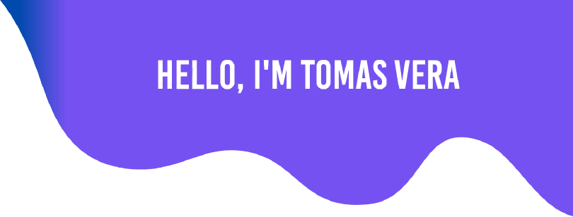
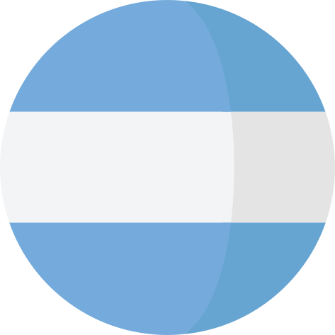

  

Hi, i'm Jr. Web Developer :smile:. I work at [EmpreWebs](https://www.emprewebs.com/) as a web developer and UX/UI designer. 

- 🔭 I’m currently working on [EmpreWebs](https://www.emprewebs.com/)
- 🌱 I’m currently studying Design UX/UI
- 📫 How to reach me: **Connect to me via Email [Tomas](mailto:tomasmvera7@gmail.com)**
- ⚡ Fun fact: Play games with friends

- :pencil2: I design webs on my free days.
- :musical_note: I love to hear chill music.

### Stack i work with :smile:

	
	
	
	
	
	

### Let's Connect :coffee:

	
	
	

 
 
     
    
 

